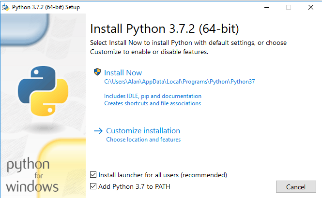

# VERIFYING THE PYTHON VERSION ON YOUR COMPUTER

Pymata Express utilizes the latest advances of the Python 3.7 asyncio library.

To check that you have Python 3.7 or greater installed
open a command window and type:

```
python3 -V
```

For Windows, you may need to type:

```
python -V
```

The Python version will be displayed:

```
python3
Python 3.7.2 (default, Dec 31 2018, 14:25:33)
[GCC 8.2.0] on linux
Type "help", "copyright", "credits" or "license" for more information.
>>>
```

For Windows users, this may look something like:
```

C:\Users\Alan>python
Python 3.7.2 (tags/v3.7.2:9a3ffc0492, Dec 23 2018, 23:09:28) [MSC v.1916 64 bit (AMD64)] on win32
Type "help", "copyright", "credits" or "license" for more information.
>>>
```

## INSTALLING PYTHON 3.7

### Windows Users

To install Python 3.7 or later, go to the
<a href="https://www.python.org/" target="_blank">Python home page,</a>
and download the latest 3.7 (or later) distribution for your operating system.

If you have Python 2.7 installed, you do not need to remove it.

During the installation process, if there is a checkbox to add Python 3.7 to your path,
 make sure it is checked before proceeding with the installation.



### Linux Users
If you are using Linux, here are the build and installation instructions

1. sudo apt-get update
1. sudo apt-get upgrade
1. sudo apt-get dist-upgrade
1. sudo apt-get install build-essential python-dev python-setuptools python-pip python-smbus
1. sudo apt-get install build-essential libncursesw5-dev libgdbm-dev libc6-dev
1. sudo apt-get install zlib1g-dev libsqlite3-dev tk-dev
1. sudo apt-get install libssl-dev openssl libreadline-dev libffi-dev
1. cd ~
1. mkdir build
1. cd build
1. wget https://www.python.org/ftp/python/3.7.2/Python-3.7.2.tgz
1. tar -zxvf Python-3.7.2.tgz
1. cd Python-3.7.2
1. ./configure
1. make
1. sudo make install

Install pip
For Debian based distributions:
```
  sudo apt-get install pip3-python
```


For all other distributions - refer to your distribution's instructions.

### Mac Users
1. Install Python 3.7.x from [https://www.python.org/downloads/](https://www.python.org/downloads/)
 or via [homebrew](http://brew.sh/)
2. Download get-pip.py from [https://bootstrap.pypa.io/get-pip.py](https://bootstrap.pypa.io/get-pip.py) and
install (this should already be installed if python was installed from python.org or homebrew):

```
curl -O https://bootstrap.pypa.io/get-pip.py
sudo python3 get-pip.py
```


### Verify The Python Installation

Use the [procedure shown here](https://mryslab.github.io/pymata-express/python_3_7.install/#verifying-the-python-version-on-your-computer) to verify that you have successfully
installed Python 3.7 on your
computer.

<br>
<br>


Copyright (C) 2019-2020 Alan Yorinks. All Rights Reserved.

